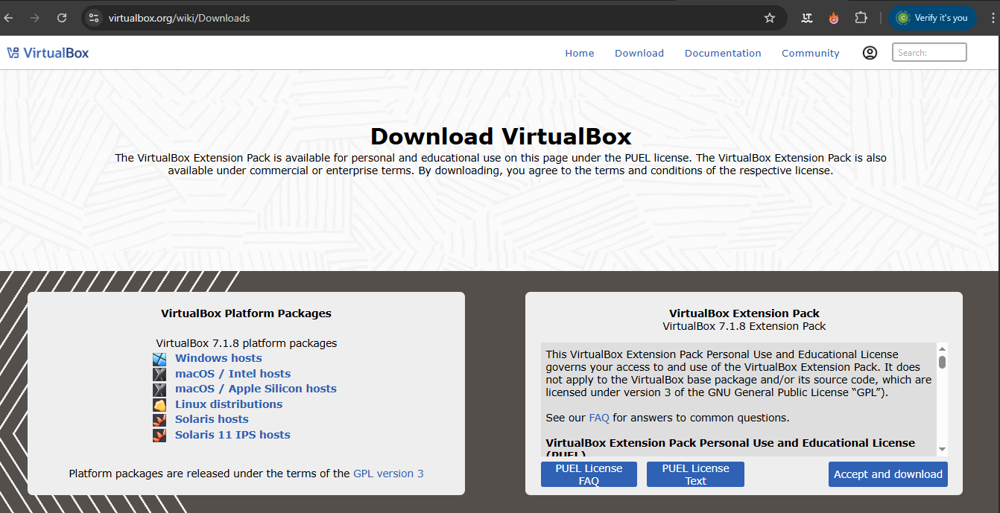
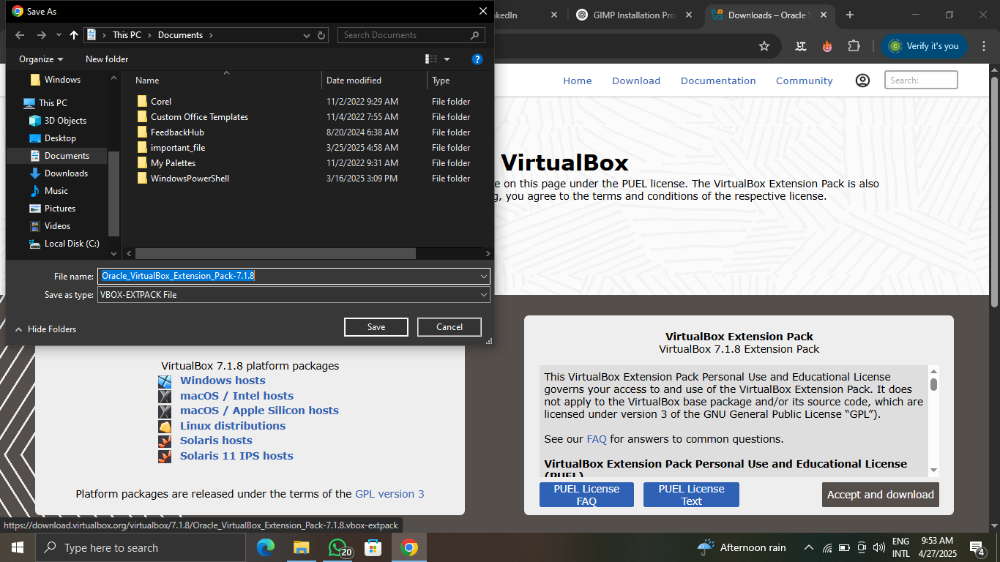
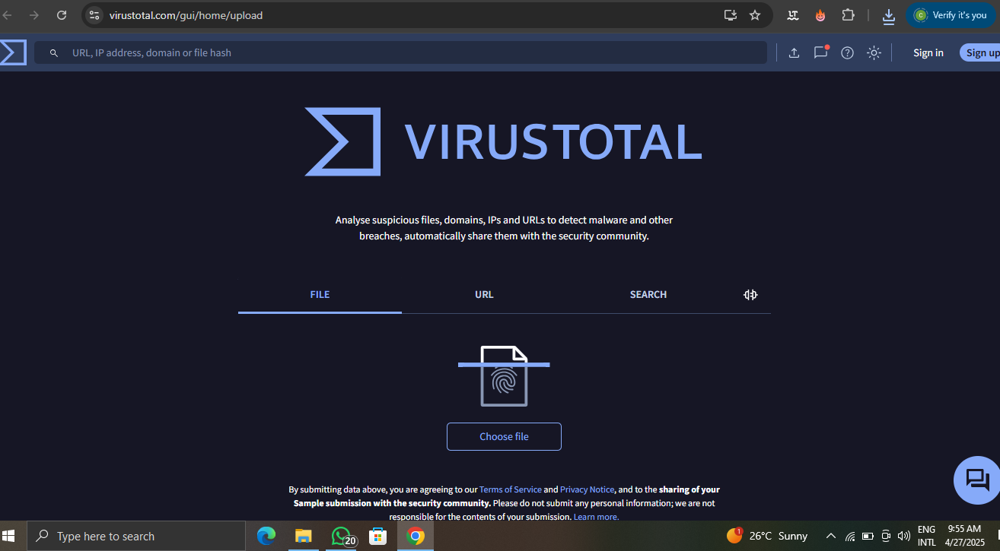
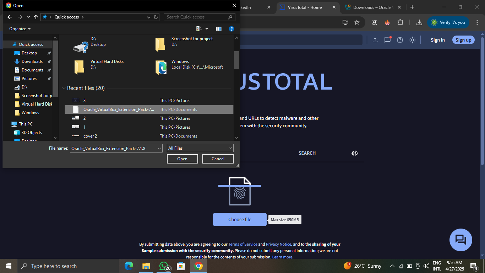
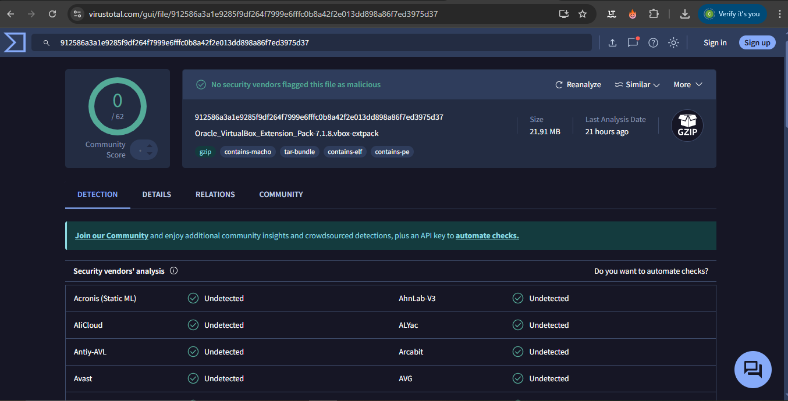

# Guided-Safe-Software-Installation-VirtualBox-Setup-Guide

Project Overview:

This project documents the step-by-step process of installing and configuring Oracle VirtualBox for use in a virtualized environment. The goal is to provide a secure, efficient solution for running multiple virtual machines on a system with limited resources. Through this project, I demonstrate best practices for software installation, system configuration, and security protocols, ensuring a smooth and stable environment for the end-user.

Project Goal:

The main goal of this project is to:

1. Demonstrate proficiency in installing and configuring Oracle VirtualBox.

2. Ensure system integrity and security by following best practices for download verification and installation.

Step 1: Choosing a trustworthy source

It's crucial to download software only from trustworthy sources to avoid malware and other security risks. Here are some tips for choosing a safe download location:
 1. **Download from the official website of the software developer**. Look for the developer's website address on the Oracle Virtualbox website. The download location is 
    (https://www.virtualbox.org/wiki/Downloads). Avoid downloading from third-party websites, especially those with unfamiliar names or displaying excessive advertisements
    
 2. **Be cautious of bundled software.** Some download websites may offer additional software alongside Oracle VirtualBox. Stay alert and make sure to avoid installing any unwanted 
    software during the installation process.

Select the appropriate compatible version depending on the Os you desired: 

  

Step 2: Verifying software authencity

Oracle VirtualBox offers a detached signature file that can be used to verify the authenticity of the downloaded installer. Here's how to verify the digital signature:

 1. Download the Oracle VirtualBox Extension Pack and the detached signature file from the official website. (https://www.virtualbox.org/wiki/Downloads)
 
   
 2. Use a tool like GPG (GNU Privacy Guard) to verify the signature. Instructions for using GPG to verify the signature can be found on the Oracle VirtualBox website. While this step is 
 optional, it provides an extra layer of security.

To verify authenticity, follow these steps:

 1. Go to the VirusTotal website (https://www.virustotal.com/)
 
    
 2. Choose the **file** option.
 

3. Drag and drop the downloaded **Oracle Virtualbox Extension Pack file** (Oracle_VirtualBox_Extension_Pack-7.1.8.vbox-extpack) in this case, but your file may have a different version number) into the designated area or choose** Select a file** and upload the file from your computer.

4. VirusTotal will scan the file and display the results, indicating if any antivirus engines detected potential threats within the file

6. Compare the encrypted value produced by the virus scanner with the one listed on the website.

**Security**

**The SHA256 checksum for Oracle_VirtualBox_Extension_Pack-7.1.8-168469.vbox-extpack is: 912586a3a1e9285f9df264f7999e6fffc0b8a42f2e013dd898a86f7ed3975d37**

**A matching number means that the file has not been tampered with.**

